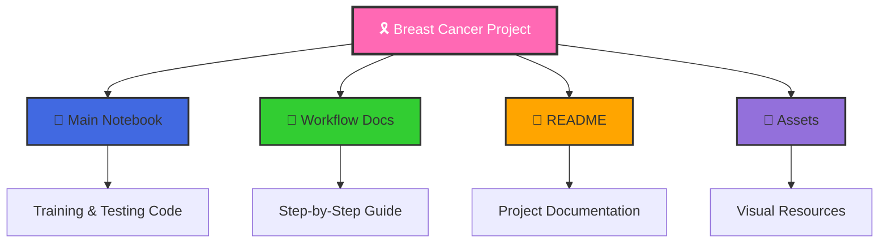
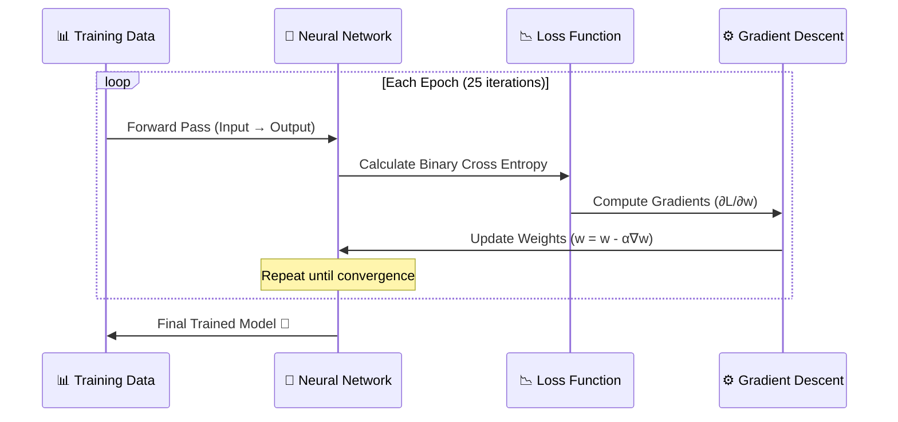
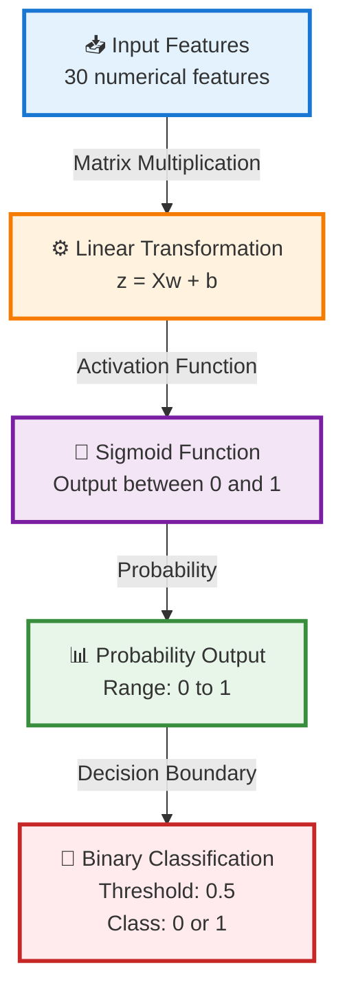
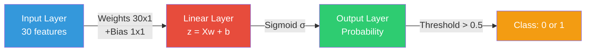

<div align="center">

# 🎗️ Breast Cancer Detection using PyTorch

### _Building Logistic Regression from Scratch with Deep Learning_

<p align="center">
  
  
  
  
</p>

<p align="center">
  
  
  
  
</p>

<p align="center">
  <a href="#-features">Features</a> •
  <a href="#-quick-start">Quick Start</a> •
  <a href="#-workflow">Workflow</a> •
  <a href="#-architecture">Architecture</a> •
  <a href="#-results">Results</a> •
  <a href="#-contributing">Contributing</a>
</p>

---

</div>

## 🌟 Overview

> **Empowering Medical AI Research with PyTorch**

This project implements a **Binary Classification Model** to detect Breast Cancer (Malignant vs. Benign) using a **Logistic Regression** model built **completely from scratch using PyTorch**. Unlike using pre-built libraries, this implementation provides a deep understanding of the underlying mathematics and neural network fundamentals.

<table>
<tr>
<td width="50%">

### 🎯 **What Makes This Special?**

- 🧮 **From-Scratch Implementation** - No black boxes
- 📊 **Clean Pipeline** - Professional ML workflow
- 🧠 **Educational** - Learn the math behind ML
- 📈 **High Accuracy** - ~91% on test data

</td>
<td width="50%">

### 📋 **Dataset Information**

- **Source**: Wisconsin Diagnostic Breast Cancer
- **Samples**: 569 instances
- **Features**: 30 numerical features
- **Classes**: Malignant (M) / Benign (B)

</td>
</tr>
</table>

---

## ✨ Features

<div align="center">

| Feature | Description                                                                 |
| :-----: | :-------------------------------------------------------------------------- |
|   🔬    | **Medical AI Application** - Real-world breast cancer detection             |
|   🧪    | **From-Scratch Neural Network** - Custom logistic regression implementation |
|   📊    | **Complete ML Pipeline** - Data preprocessing to model evaluation           |
|   🎯    | **High Performance** - Achieves ~91% accuracy on test data                  |
|   📚    | **Educational** - Detailed comments and mathematical explanations           |
|   🔄    | **Reproducible** - Consistent results with proper random seeding            |

</div>

---

## 📂 Project Structure

```
📦 BrestCancer/
├── 📓 Breast_Cancer_Detection_PyTorch.ipynb  # Main Jupyter Notebook
├── 📄 FULL WORKFLOW EXPLANATION.txt      # Detailed workflow documentation
├── 📝 README.md                              # Project documentation (you're here!)
└── 📂 assets/                                # Images and diagrams
```

### **File Overview**



---

## 🚀 Quick Start

### Prerequisites

<div align="center">


</div>

### 📦 Installation

**Option 1: Install all dependencies at once**

```bash
pip install numpy pandas torch scikit-learn jupyter
```

**Option 2: Install individually**

<details>
<summary>Click to expand individual installation commands</summary>

```bash
# Core scientific computing
pip install numpy          # Array operations
pip install pandas         # Data manipulation

# Machine Learning
pip install torch          # PyTorch framework
pip install scikit-learn   # Preprocessing & metrics

# Notebook environment
pip install jupyter        # Interactive development
```

</details>

### 📋 Dependency Table

<table align="center">
<thead>
  <tr>
    <th>Library</th>
    <th>Version</th>
    <th>Purpose</th>
    <th>Installation</th>
  </tr>
</thead>
<tbody>
  <tr>
    <td><b>NumPy</b></td>
    <td>≥ 1.19</td>
    <td>Numerical computations</td>
    <td><code>pip install numpy</code></td>
  </tr>
  <tr>
    <td><b>Pandas</b></td>
    <td>≥ 1.1</td>
    <td>Data handling & analysis</td>
    <td><code>pip install pandas</code></td>
  </tr>
  <tr>
    <td><b>PyTorch</b></td>
    <td>≥ 1.7</td>
    <td>Deep learning framework</td>
    <td><code>pip install torch</code></td>
  </tr>
  <tr>
    <td><b>Scikit-Learn</b></td>
    <td>≥ 0.23</td>
    <td>Preprocessing & metrics</td>
    <td><code>pip install scikit-learn</code></td>
  </tr>
  <tr>
    <td><b>Jupyter</b></td>
    <td>Latest</td>
    <td>Interactive notebook</td>
    <td><code>pip install jupyter</code></td>
  </tr>
</tbody>
</table>

### 🏃‍♂️ Running the Project

```bash
# Clone the repository (if applicable)
git clone <repository-url>
cd BrestCancer

# Launch Jupyter Notebook
jupyter notebook Breast_Cancer_Detection_PyTorch.ipynb

# Or use Jupyter Lab for a modern interface
jupyter lab
```

> 💡 **Tip**: You can also run this notebook on [Google Colab](https://colab.research.google.com/) for free GPU access!

---

## � Complete Workflow Pipeline

<div align="center">

### **End-to-End Machine Learning Pipeline**

</div>


### **Detailed Pipeline Steps**

<table>
<tr>
<td width="5%">1️⃣</td>
<td width="20%"><b>Import Libraries</b></td>
<td>Load necessary Python libraries (<code>numpy</code>, <code>pandas</code>, <code>torch</code>, <code>sklearn</code>)</td>
</tr>
<tr>
<td>2️⃣</td>
<td><b>Load Dataset</b></td>
<td>Fetch the Breast Cancer dataset from remote URL or local storage</td>
</tr>
<tr>
<td>3️⃣</td>
<td><b>Data Cleaning</b></td>
<td>Remove unused/irrelevant columns (<code>id</code>, <code>Unnamed: 32</code>)</td>
</tr>
<tr>
<td>4️⃣</td>
<td><b>Train-Test Split</b></td>
<td>Divide data into training (80%) and testing (20%) sets</td>
</tr>
<tr>
<td>5️⃣</td>
<td><b>Feature Scaling</b></td>
<td>Normalize features using <code>StandardScaler</code> for better convergence</td>
</tr>
<tr>
<td>6️⃣</td>
<td><b>Label Encoding</b></td>
<td>Convert categorical labels (<code>M</code>, <code>B</code>) to numerical values (<code>1</code>, <code>0</code>)</td>
</tr>
<tr>
<td>7️⃣</td>
<td><b>PyTorch Tensors</b></td>
<td>Convert NumPy arrays to PyTorch tensors for GPU acceleration</td>
</tr>
<tr>
<td>8️⃣</td>
<td><b>Define Model</b></td>
<td>Create custom Logistic Regression neural network class</td>
</tr>
<tr>
<td>9️⃣</td>
<td><b>Loss Function</b></td>
<td>Implement <b>Binary Cross Entropy Loss</b> manually from scratch</td>
</tr>
<tr>
<td>🔟</td>
<td><b>Training Loop</b></td>
<td>Train using Gradient Descent: Forward → Loss → Backward → Update</td>
</tr>
<tr>
<td>1️⃣1️⃣</td>
<td><b>Evaluation</b></td>
<td>Test model accuracy on unseen test data and compute metrics</td>
</tr>
</table>

<div align="center">

### **Training Process Visualization**



</div>

---

## 🧠 Neural Network Architecture & Logic

<div align="center">

### **From-Scratch Logistic Regression Model**

</div>

We define a custom neural network model called `MySimpleNN` that implements Logistic Regression using only PyTorch tensors and operations.

### 🏗️ Architecture Diagram



### 📐 Mathematical Foundation

<div align="center">

|        Component         |                            Formula                            | Description               |
| :----------------------: | :-----------------------------------------------------------: | :------------------------ |
|  **Linear Combination**  |                         $z = Xw + b$                          | Weighted sum of inputs    |
|  **Sigmoid Activation**  |              $\sigma(z) = \frac{1}{1 + e^{-z}}$               | Maps to probability [0,1] |
| **Binary Cross Entropy** | $L = -\frac{1}{n}\sum[y\log(\hat{y}) + (1-y)\log(1-\hat{y})]$ | Loss function             |
|   **Gradient Descent**   |        $w = w - \alpha \frac{\partial L}{\partial w}$         | Weight update rule        |

</div>

### 🔧 Key Components

<table>
<tr>
<td width="30%"><b>🎲 Weights (w)</b></td>
<td>Randomly initialized tensor of shape <code>(30, 1)</code> with <code>requires_grad=True</code></td>
</tr>
<tr>
<td><b>📍 Bias (b)</b></td>
<td>Zero-initialized tensor for offset adjustment</td>
</tr>
<tr>
<td><b>➡️ Forward Pass</b></td>
<td>Computes <code>z = Xw + b</code> followed by <code>Sigmoid(z)</code> activation</td>
</tr>
<tr>
<td><b>📉 Loss Function</b></td>
<td>Custom Binary Cross Entropy implementation (not using PyTorch's built-in)</td>
</tr>
<tr>
<td><b>🔙 Backpropagation</b></td>
<td>Automatic differentiation via PyTorch's autograd engine</td>
</tr>
<tr>
<td><b>⚡ Optimizer</b></td>
<td>Manual Gradient Descent implementation with learning rate α=0.1</td>
</tr>
</table>

### 💻 Code Implementation

<details>
<summary><b>Click to expand: Model Class Implementation</b></summary>

```python
class MySimpleNN:
    """
    Custom Logistic Regression Neural Network
    Built from scratch using PyTorch tensors
    """
    def __init__(self, X):
        # Initialize weights randomly from normal distribution
        self.weights = torch.randn(X.shape[1], 1, requires_grad=True)

        # Initialize bias to zero
        self.bias = torch.zeros(1, requires_grad=True)

    def forward(self, X):
        """
        Forward propagation through the network

        Args:
            X: Input features tensor

        Returns:
            Sigmoid activated output (probabilities)
        """
        # Linear transformation: z = Xw + b
        z = torch.matmul(X, self.weights) + self.bias

        # Apply sigmoid activation: σ(z) = 1/(1+e^(-z))
        return torch.sigmoid(z)
```

</details>

<details>
<summary><b>Click to expand: Loss Function Implementation</b></summary>

```python
def binary_cross_entropy_loss(y_pred, y_true):
    """
    Custom Binary Cross Entropy Loss

    Formula: L = -1/n * Σ[y*log(ŷ) + (1-y)*log(1-ŷ)]

    Args:
        y_pred: Predicted probabilities
        y_true: True labels (0 or 1)

    Returns:
        Average loss across all samples
    """
    epsilon = 1e-7  # Small constant to avoid log(0)

    # Clip predictions to prevent log(0)
    y_pred = torch.clamp(y_pred, epsilon, 1 - epsilon)

    # Calculate BCE loss
    loss = -torch.mean(
        y_true * torch.log(y_pred) +
        (1 - y_true) * torch.log(1 - y_pred)
    )

    return loss
```

</details>

### 🎯 Model Architecture Summary



---

## 📊 Results and Performance

<div align="center">

### **Model Performance Metrics**

<table>
<thead>
  <tr>
    <th>Metric</th>
    <th>Value</th>
    <th>Visualization</th>
  </tr>
</thead>
<tbody>
  <tr>
    <td><b>🎯 Accuracy</b></td>
    <td><h3>91.23%</h3></td>
    <td>
      
    </td>
  </tr>
  <tr>
    <td><b>📈 Epochs</b></td>
    <td>25</td>
    <td>⏱️ Quick convergence</td>
  </tr>
  <tr>
    <td><b>⚡ Learning Rate</b></td>
    <td>0.1</td>
    <td>🎚️ Optimal for this dataset</td>
  </tr>
  <tr>
    <td><b>🔢 Parameters</b></td>
    <td>31 (30 weights + 1 bias)</td>
    <td>💾 Lightweight model</td>
  </tr>
</tbody>
</table>

</div>

### 📉 Training Progression


### 🎨 Performance Highlights

<table>
<tr>
<td width="50%">

#### ✅ **Strengths**

- 🎯 High accuracy on test data
- ⚡ Fast training convergence
- 📉 Low computational cost
- 🧮 Simple, interpretable model
- 💡 Easy to understand and debug

</td>
<td width="50%">

#### 🔄 **Potential Improvements**

- 🔬 Add more evaluation metrics
- 📊 Implement confusion matrix
- 🎚️ Try different learning rates
- 🔁 Add early stopping
- 🧪 K-fold cross-validation

</td>
</tr>
</table>

### 💻 Evaluation Code

```python
# Make predictions on test set
with torch.no_grad():
    y_pred = model.forward(X_test_tensor)
    y_pred_cls = (y_pred >= 0.5).float()

# Calculate accuracy
accuracy = (y_pred_cls == y_test_tensor).float().mean()
print(f"Test Accuracy Score: {accuracy.item() * 100:.2f}%")
```

### 📌 Important Notes

> ⚠️ **Note**: Accuracy may vary slightly (±1-2%) due to:
>
> - Random initialization of weights
> - Stochastic nature of gradient descent
> - Train-test split randomness
>
> 💡 **Tip**: Use `torch.manual_seed()` for reproducible results!

<div align="center">

### **Confusion Matrix (Conceptual)**

|                       | Predicted: Benign | Predicted: Malignant |
| :-------------------: | :---------------: | :------------------: |
|  **Actual: Benign**   | ✅ True Negative  |  ❌ False Positive   |
| **Actual: Malignant** | ❌ False Negative |   ✅ True Positive   |

</div>

---

## 🎮 Usage Guide

### **Step 1: Clone & Navigate**

```bash
# Clone the repository (if applicable)
git clone <repository-url>
cd BrestCancer
```

### **Step 2: Set Up Environment**

```bash
# Install dependencies
pip install -r requirements.txt

# Or install manually
pip install numpy pandas torch scikit-learn jupyter
```

### **Step 3: Launch Notebook**

<table>
<tr>
<td width="50%">

#### **Option A: Jupyter Notebook**

```bash
jupyter notebook Breast_Cancer_Detection_PyTorch.ipynb
```

Traditional notebook interface

</td>
<td width="50%">

#### **Option B: Jupyter Lab**

```bash
jupyter lab
```

Modern, feature-rich interface

</td>
</tr>
<tr>
<td>

#### **Option C: VS Code**

```bash
code .
```

Use VS Code notebook support

</td>
<td>

#### **Option D: Google Colab**

```
Upload notebook to Colab
```

Free GPU/TPU access ☁️

</td>
</tr>
</table>

### **Step 4: Run All Cells**

1. 🔄 Execute cells sequentially from top to bottom
2. 📊 Watch the training progress
3. 🎯 View the final accuracy results

### 🎯 Quick Example

```python
# Quick test prediction example
import torch

# Sample feature values (30 features)
sample_data = torch.randn(1, 30)

# Make prediction
with torch.no_grad():
    prediction = model.forward(sample_data)
    class_label = "Malignant" if prediction >= 0.5 else "Benign"

print(f"Prediction: {class_label} (Confidence: {prediction.item():.2%})")
```

---

## 🤝 Contributing

<div align="center">

**We welcome contributions!** 🎉

</div>

### How to Contribute

<table>
<tr>
<td>1️⃣</td>
<td><b>Fork the Project</b></td>
<td>Create your own copy of the repository</td>
</tr>
<tr>
<td>2️⃣</td>
<td><b>Create a Branch</b></td>
<td><code>git checkout -b feature/AmazingFeature</code></td>
</tr>
<tr>
<td>3️⃣</td>
<td><b>Commit Changes</b></td>
<td><code>git commit -m 'Add some AmazingFeature'</code></td>
</tr>
<tr>
<td>4️⃣</td>
<td><b>Push to Branch</b></td>
<td><code>git push origin feature/AmazingFeature</code></td>
</tr>
<tr>
<td>5️⃣</td>
<td><b>Open Pull Request</b></td>
<td>Submit your changes for review</td>
</tr>
</table>

### 💡 Contribution Ideas

- 📊 Add visualization of training loss
- 🔬 Implement additional metrics (precision, recall, F1)
- 🎨 Create confusion matrix visualization
- 📈 Add learning rate scheduling
- 🧪 Implement cross-validation
- 📝 Improve documentation
- 🐛 Report bugs or issues

---

## ❓ FAQ (Frequently Asked Questions)

<details>
<summary><b>Q: Why build from scratch instead of using sklearn's LogisticRegression?</b></summary>

**A:** This project is educational! Building from scratch helps you understand:

- The mathematics behind logistic regression
- How neural networks actually work
- PyTorch's autograd mechanism
- Gradient descent optimization process

</details>

<details>
<summary><b>Q: Can I use this for other binary classification tasks?</b></summary>

**A:** Absolutely! Just replace the dataset loading part with your own data. The model architecture works for any binary classification problem.

</details>

<details>
<summary><b>Q: Why is my accuracy different from 91.23%?</b></summary>

**A:** Slight variations (±1-2%) are normal due to:

- Random weight initialization
- Random train-test split
- Floating-point precision

Use `torch.manual_seed(42)` for reproducibility!

</details>

<details>
<summary><b>Q: Can I use GPU for faster training?</b></summary>

**A:** Yes! Add this code before training:

```python
device = torch.device('cuda' if torch.cuda.is_available() else 'cpu')
X_train_tensor = X_train_tensor.to(device)
model.weights = model.weights.to(device)
# ... move other tensors to device
```

</details>

<details>
<summary><b>Q: How can I save the trained model?</b></summary>

**A:** Save the weights and bias:

```python
torch.save({
    'weights': model.weights,
    'bias': model.bias
}, 'breast_cancer_model.pth')
```

</details>

<details>
<summary><b>Q: What's the difference between this and deep learning?</b></summary>

**A:** This is a single-layer neural network (logistic regression). Deep learning uses multiple layers. This project teaches the fundamentals that scale to deeper networks!

</details>

---

## 📚 Dataset Information

### **Breast Cancer Wisconsin (Diagnostic) Dataset**

<table>
<tr>
<td width="30%"><b>📊 Total Samples</b></td>
<td>569 instances</td>
</tr>
<tr>
<td><b>📈 Features</b></td>
<td>30 numerical features (computed from cell nuclei images)</td>
</tr>
<tr>
<td><b>🎯 Classes</b></td>
<td>
  <ul>
    <li><b>Malignant (M)</b>: 212 samples (37.3%)</li>
    <li><b>Benign (B)</b>: 357 samples (62.7%)</li>
  </ul>
</td>
</tr>
<tr>
<td><b>🔬 Feature Types</b></td>
<td>Radius, Texture, Perimeter, Area, Smoothness, Compactness, Concavity, Concave Points, Symmetry, Fractal Dimension (each with mean, SE, and worst values)</td>
</tr>
<tr>
<td><b>📍 Source</b></td>
<td>UCI Machine Learning Repository / sklearn.datasets</td>
</tr>
<tr>
<td><b>📅 Created</b></td>
<td>Dr. William H. Wolberg, W. Nick Street, Olvi L. Mangasarian</td>
</tr>
</table>

### 🔍 Feature Engineering

The 30 features are organized into 3 groups of 10:

- **Mean values** (features 1-10)
- **Standard error** (features 11-20)
- **Worst/largest** (features 21-30)

Each group contains measurements for: radius, texture, perimeter, area, smoothness, compactness, concavity, concave points, symmetry, and fractal dimension.

---

## 📖 Learning Resources

<div align="center">

### **Expand Your Knowledge**

</div>

| Topic                      | Resources                                                                                                           |
| :------------------------- | :------------------------------------------------------------------------------------------------------------------ |
| 🧮 **Linear Algebra**      | [3Blue1Brown - Essence of Linear Algebra](https://www.youtube.com/playlist?list=PLZHQObOWTQDPD3MizzM2xVFitgF8hE_ab) |
| 🧠 **Neural Networks**     | [3Blue1Brown - Neural Networks](https://www.youtube.com/playlist?list=PLZHQObOWTQDNU6R1_67000Dx_ZCJB-3pi)           |
| 🔥 **PyTorch**             | [Official PyTorch Tutorials](https://pytorch.org/tutorials/)                                                        |
| 📊 **Machine Learning**    | [Andrew Ng's ML Course](https://www.coursera.org/learn/machine-learning)                                            |
| 📈 **Logistic Regression** | [StatQuest: Logistic Regression](https://www.youtube.com/watch?v=yIYKR4sgzI8)                                       |

---

## 📜 License

<div align="center">

This project is licensed under the **MIT License**

[](https://opensource.org/licenses/MIT)

See the [LICENSE](LICENSE) file for details.

</div>

---

## 🙏 Acknowledgements

<div align="center">

**Special Thanks To:**

</div>

- 🩺 **Dr. William H. Wolberg** - for creating the Breast Cancer Wisconsin dataset
- 🔥 **PyTorch Team** - for the amazing deep learning framework
- 📊 **Scikit-Learn Contributors** - for excellent ML utilities
- 🎓 **Open Source Community** - for continuous support and inspiration
- 💖 **Medical AI Researchers** - for advancing healthcare through technology

---

## 📞 Contact & Support

<div align="center">

### **Get in Touch**

<table>
<tr>
<td align="center">
<b>🐛 Found a Bug?</b><br>
<a href="https://github.com/yourusername/BrestCancer/issues">Report Issue</a>
</td>
<td align="center">
<b>💡 Have an Idea?</b><br>
<a href="https://github.com/yourusername/BrestCancer/issues">Request Feature</a>
</td>
<td align="center">
<b>❓ Need Help?</b><br>
<a href="https://github.com/yourusername/BrestCancer/discussions">Join Discussion</a>
</td>
</tr>
</table>

---

### **Show Your Support**

If you found this project helpful, please consider:

⭐ **Star** this repository  
🔀 **Fork** and contribute  
📢 **Share** with others  
💬 **Provide feedback**

---


</div>

---

## 🏆 Project Stats

<div align="center">


</div>

---

<div align="center">

### **Made with ❤️ for Medical AI Research**

_Empowering Healthcare through Machine Learning_

---

## 🎓 Project Credits

<table align="center">
<tr>
<td align="center">

<br><b>👨‍💻 Development</b>
<br><sub>SEM 7 Student Project</sub>
<br><sub>PyTorch Implementation</sub>
</td>
<td align="center">

<br><b>🔥 AI Framework</b>
<br><sub>PyTorch</sub>
<br><sub>Deep Learning Library</sub>
</td>
<td align="center">

<br><b>🧪 ML Library</b>
<br><sub>Scikit-Learn</sub>
<br><sub>Data Preprocessing</sub>
</td>
</tr>
<tr>
<td align="center">

<br><b>🛠️ Open Source Tools</b>
<br><sub>NumPy, Pandas</sub>
<br><sub>Python Ecosystem</sub>
</td>
<td align="center">

<br><b>🩺 Medical Dataset</b>
<br><sub>Wisconsin Breast Cancer</sub>
<br><sub>UCI ML Repository</sub>
</td>
<td align="center">

<br><b>📓 Environment</b>
<br><sub>Jupyter Notebook</sub>
<br><sub>Interactive Computing</sub>
</td>
</tr>
</table>

---

**© 2026 Breast Cancer Detection Project**

<sub>This project is for educational purposes. Not intended for clinical diagnosis.</sub>

---

<p>
  <a href="#-overview">Back to Top ↑</a>
</p>

</div>
